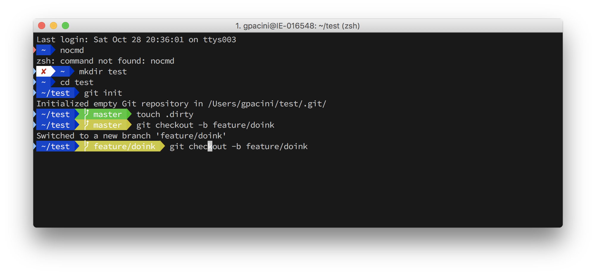

# My .files for macOS

Looking for this?

## Installing iTerm2 with oh-my-zsh

### iTerm2
[Install this](https://www.iterm2.com/) and never use the default Terminal.app again.

### Install Source Code Pro
[Get it here](https://github.com/adobe-fonts/source-code-pro/releases/tag/2.030R-ro%2F1.050R-it). Download the source code zip file, then navigate to the `OTF` folder. Open `SourceCodePro-Regular.otf` and click "Install Font".

### Finalise iTerm2 Settings
 - Preferences → General → "Load preferences from a custom folder or URL:" set to the `iTerm2` folder in this repo.
 - Install Shell Integration

### oh-my-zsh
    
    sh -c "$(curl -fsSL https://raw.github.com/robbyrussell/oh-my-zsh/master/tools/install.sh)"
    
When the installation is done, edit `~/.zshrc` based on the `zshrc` file in the `zsh` folder in this repo.

Restart iTerm2 for all changes to take effect.

## Other Programs to Install
 - [Brew](https://brew.sh/)
 - [Docker](https://docs.docker.com/docker-for-mac/install/)
 - [NVM](http://yoember.com/nodejs/the-best-way-to-install-node-js/)
 - [VS Code](https://code.visualstudio.com/docs?dv=osx)

## Other Configs
 
### VS Code
 - Open VS Code and go into the User Settings (`⌘` + `,`) and copy in the `settings.json` from the `VSCode` folder.

